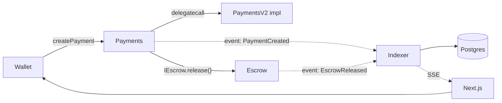

# 10. Documentation & Demo Presentation

The code is half the deliverable. Documentation and a rehearsed demo are
what make it *credible* to auditors, teammates, and interviewers.

## 10.1 NatSpec and readable contracts

NatSpec is Solidity's doc standard — it's rendered by explorers and
extracted by tools (`forge doc`, `npx solhint`). The discipline:

- Every contract: `@title`, `@notice`, `@dev` (security-relevant
  invariants, upgradeability notes, trust assumptions).
- Every public/external function: `@param`, `@return`, and `@dev` for
  edge cases. `@custom:` tags for project-specific notes
  (`@custom:oz-upgrades-unsafe-allow` is required by the OZ plugin).
- **Document invariants and failure modes in prose** — a reviewer should be
  able to understand the threat model without reading the bytecode.

```solidity
/// @title Payments
/// @notice Creates, approves, and executes token payments that settle in
///         an escrow contract.
/// @dev Upgradeable via UUPS; only the DEFAULT_ADMIN_ROLE (a multisig) may
///      upgrade. All fund movements happen in the escrow contract, never
///      here — this contract holds no balances by design.
contract Payments is Initializable, UUPSUpgradeable, AccessControlDefaultAdminRules {
    /// @notice Create a payment locking `amount` tokens for `payee`.
    /// @param payee The recipient (must not be the zero address).
    /// @param amount Amount in token base units; must be > 0.
    /// @return paymentId Monotonic id of the new payment.
    /// @dev Emits {PaymentCreated}. Reverts with {InsufficientAmount} when
    ///      `amount == 0` and {InsufficientAllowance} when the sender has
    ///      not approved this contract.
    function createPayment(address payee, uint256 amount)
        external
        whenNotPaused
        returns (uint256 paymentId)
    { /* ... */ }
}
```

Pair NatSpec with **`natspec` checks in CI** (missing docs fail the build —
solhint's `natspec` rules or `forge doc`) so quality doesn't decay.

## 10.2 README and architecture diagrams

A developer-facing README is the first thing an auditor/interviewer reads.
Structure (this repo's README is a strong model):

1. **One-paragraph pitch** + a diagram of the system (users, contracts,
   indexer, frontend — arrows for *data flow*, not just boxes).
2. **Architecture** — contract relationships and the event flow.
3. **Local setup** — exact commands from a clean clone (`git clone` → env →
   infra → run), not "requires Node 20, Docker…" vibes.
4. **Deployment & verification** — the §5 checklist, per network.
5. **Testing** — what's covered, what isn't, how to run.
6. **Security model** — roles, trust assumptions, known limitations
   (honest limitations are a *good* signal).
7. **License** — real projects specify one.

Diagrams: **Mermaid** renders on GitHub and is versionable — keep diagrams
*in* the repo, next to the code they describe:



## 10.3 The live demo script

A live demo fails; a **rehearsed script** survives. Write
`docs/demo.md` (this repo already has one) with:

- **The narrative arc** — a *story*, not a feature list: "Alice pays Bob
  $500 for the design; Bob delivers; Alice releases the escrow. Watch the
  activity feed update in real time."
- **Exact steps with expected outputs** — every click, every event name,
  every status badge change. If the demo shows an event, the script states
  the exact event string to watch for.
- **Pre-demo checklist** — fresh testnet accounts funded, contracts
  deployed & verified, indexer synced (lag ≈ 0), wallet connected, phone
  hotspot as backup for the "no wifi" failure mode.
- **Failure fallbacks** — if the indexer dies: "let me show you the REST
  fallback"; if the wallet rejects: "this is the error-handling layer";
  if the chain is congested: show the pending→confirmed state machine.
  A demo that survives a failure *demonstrates* your error handling (§7).
- **The technical-decision moment** — plan one beat that shows judgment:
  "we chose a custom indexer over The Graph because our activity feed needs
  sub-second latency and joins with off-chain data" (§3.3). That's what
  separates a demo from a screenshot tour.
- **Timing** — a 5-minute version (connect → create → approve → execute →
  realtime update) and a 15-minute version (adds disputes, failure paths,
  upgrade flow on a fork).

## 10.4 The stakeholder/recruiter writeup

For a portfolio piece or interview, structure the writeup like an
engineering doc, not a tutorial:

1. **Problem** — one paragraph: payments and escrow are slow, trust-heavy,
   and opaque. (Stakeholders buy outcomes, not features.)
2. **Solution & architecture** — the diagram above, plus the three-layer
   story: contracts (state & rules), indexer (data & realtime), frontend
   (UX). Name the key *decisions*, not just the stack.
3. **Security & correctness** — this is what separates senior work: threat
   model, access control model, upgrade strategy, test strategy (fuzz +
   invariants + E2E), audit-readiness.
4. **Trade-offs, made explicitly** — a table of what you chose vs
   rejected *and why* (Hardhat vs Foundry, The Graph vs custom indexer,
   proxy vs immutable). Recruiters look for judgment, and judgment lives
   in trade-offs.
5. **Metrics & results** — test counts, coverage, gas costs before/after
   optimization, indexer latency, uptime. Concrete numbers beat adjectives.
6. **What's next** — honest roadmap (multisig custody, cross-chain, E2E
   suite); honesty about limitations is credibility.

Format guidance for slides: one idea per slide, the architecture diagram on
its own slide, a live demo *after* the architecture (never before), and a
"failure I handled" slide — engineers remember how you debugged more than
what you built.

## Mapping to StellarFlow

- The repo's `docs/` (architecture, contracts, frontend, deployment,
  testing, demo) already implements most of §10 — the EVM additions to
  steal: **Mermaid diagrams in markdown** (this repo uses ASCII art, which
  is fine but not renderable), **NatSpec-style doc comments with security
  notes** in the Rust contracts (`/// # Panics`, invariants in doc
  comments), and a **trade-offs table in the README** (the README has one
  implicitly; make it explicit for interviewers).
- `docs/demo.md` exists — audit it against §10.3's checklist (expected
  outputs spelled out? fallbacks scripted? a technical-decision beat?).

---

That's the full curriculum. Suggested capstone exercise: implement the
§8.4 E2E suite (anvil + Playwright) for StellarFlow's canonical flow — it
forces you to touch every layer from §1–§10 at once, and it's a fantastic
demo piece on its own.